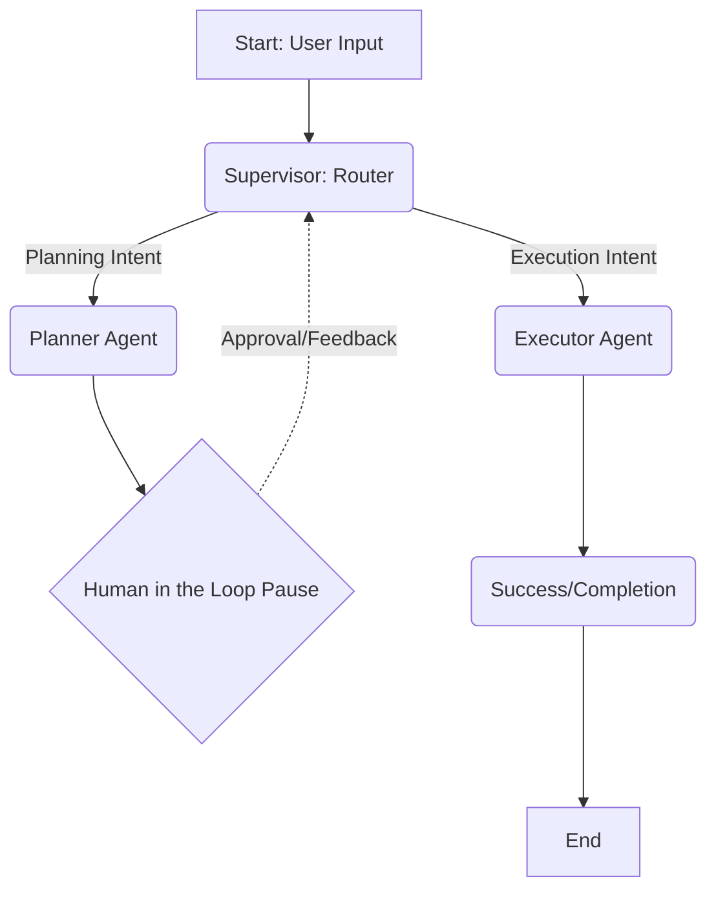

# Chaos Master Orchestrator (agent_v2) – Unified Architecture

I have successfully implemented the **Master Orchestrator** (Supervisor) pattern using **LangGraph**. This unified architecture merges the Planning and Execution phases into a single, intelligent state machine, providing a seamless end-to-end chaos engineering experience.

## What Was Accomplished

### 1. Master Orchestrator (Supervisor)
- **Supervisor Node**: An intelligent router that analyzes user messages and automatically switches between the **Planner** and the **Executor**.
- **Unified Graph ([master.py](file:///c:/Users/prems/Documents/Work/chaos_engineering/agent_v2/app/graph/master.py))**: A single LangGraph that manages the entire lifecycle from discovery to execution.
- **Unified State ([state.py](file:///c:/Users/prems/Documents/Work/chaos_engineering/agent_v2/app/graph/state.py))**: A shared `ChaosState` that maintains context and routing across both agents.

### 2. Scalable Fault Registry
- **Fault Registry ([fault_registry.json](file:///c:/Users/prems/Documents/Work/chaos_engineering/agent_v2/app/fault_registry.json))**: A single source of truth for all supported faults.
- **Discovery Tools**: `get_fault_catalog` and `get_fault_schema` for on-demand knowledge fetching.
- **Unified Generator**: `generate_chaos_engines` handles template rendering for any fault in the registry.

### 3. Simplified API Surface
- **Unified `/chat` Endpoint**: A single endpoint for both planning and execution. The AI now transitions to execution naturally when you say "Go", "Run it", or "Approved".
- **Consolidated Prompts ([chaos_prompts.py](file:///c:/Users/prems/Documents/Work/chaos_engineering/agent_v2/app/prompts/chaos_prompts.py))**: All agent instructions (Supervisor, Planner, Executor) are now managed in a single file.

## Visualizing the Flow



## How to Add a New Chaos Fault

Adding a new fault is a data-driven process with **zero code changes**:

1. **Update Registry**: Add an entry to [fault_registry.json](file:///c:/Users/prems/Documents/Work/chaos_engineering/agent_v2/app/fault_registry.json).
2. **Add Configs**: Place the `.yaml.j2` template and `install.yaml` in `app/fault_configs/`.
3. **Automated Support**: The Planner will discover it, and the Executor will be able to generate it immediately.

## Running the Application Locally

1. **Setup**:
   ```bash
   cd agent_v2
   python -m venv venv
   venv\Scripts\activate
   pip install -r requirements.txt
   ```

2. **Start**:
   ```bash
   uvicorn app.main:app --reload
   ```

3. **Test**:
   Send a POST request to `/chat`:
   ```json
   {
     "thread_id": "chaos-test-1",
     "message": "I want to test pod-delete on backend."
   }
   ```
   Once the plan is ready, simply reply "Approved" or "Run it" in the same thread to trigger execution!
