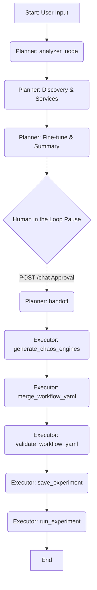

# Planner & Executor Agents (agent_v2) – Scalable Chaos Architecture

I have successfully implemented a scalable, discovery-driven architecture for the **Planner** and **Executor** agents using **LangGraph**. This design decouples chaos fault knowledge from the LLM prompts, allowing the system to support 30+ faults with minimal token overhead and easy maintenance.

## What Was Accomplished

### 1. Scalable Fault Registry
- **Fault Registry ([fault_registry.json](file:///c:/Users/prems/Documents/Work/chaos_engineering/agent_v2/app/fault_registry.json))**: A single source of truth defining all supported faults (e.g., `pod-delete`, `pod-cpu-hog`), their descriptions, and parameter schemas.
- **Dynamic Discovery Tools**:
    - `get_fault_catalog`: Allows agents to see available faults.
    - `get_fault_schema`: Allows agents to fetch parameters for a specific fault on-demand.
- **Unified Generator**: `generate_chaos_engines` handles template rendering for any fault in the registry, replacing per-fault generator tools.

### 2. Consolidated Prompts & Architecture
- **Consolidated Prompts ([chaos_prompts.py](file:///c:/Users/prems/Documents/Work/chaos_engineering/agent_v2/app/prompts/chaos_prompts.py))**: Merged Planner and Executor instructions into a single file for better maintainability.
- **Shared Cleanup**: Renamed `pod-delete-cleanup.yaml` to `chaos-cleanup.yaml` to reflect its role as a global resource for all experiment types.

### 3. LangGraph Orchestration
- **Planner Agent**: Uses discovery tools to design experiments based on user goals, identifies target services, and fine-tunes parameters.
- **Executor Agent**: Receives the plan, calls the unified generator, merges the workflow, validates, saves, and executes the experiment.
- **Human-in-the-Loop**: Integrated `interrupt_before` to allow user validation of the execution plan before handoff to the executor.

## Visualizing the Flow



## How to Add a New Chaos Fault

Adding a new fault is now a data-driven process that requires **zero code changes** to the agents or prompts.

1. **Update Registry**: Add a new entry to [fault_registry.json](file:///c:/Users/prems/Documents/Work/chaos_engineering/agent_v2/app/fault_registry.json) with:
   - `description`: What the fault does.
   - `template`: Name of the Jinja2 engine template.
   - `install_yaml`: Name of the fault installation YAML.
   - `parameters`: A dictionary of all parameters (type, required, default, description).

2. **Add Configuration Files**: Place the following in `app/fault_configs/`:
   - The engine template (e.g., `new-fault-engine.yaml.j2`).
   - The installation YAML (e.g., `new-fault-install.yaml`).

3. **That's it!** The Planner will automatically discover the new fault via `get_fault_catalog` and the Executor will be able to generate it using the unified `generate_chaos_engines` tool.

## Running the Application Locally

1. **Setup Environment**:
   ```bash
   cd agent_v2
   python -m venv venv
   venv\Scripts\activate
   pip install -r requirements.txt
   ```

2. **Start Service**:
   ```bash
   uvicorn app.main:app --reload
   ```

3. **Test with API**:
   Use `/docs` or send a POST request to `/chat`:
   ```json
   {
     "thread_id": "test-123",
     "message": "I want to test pod resource hogs"
   }
   ```
