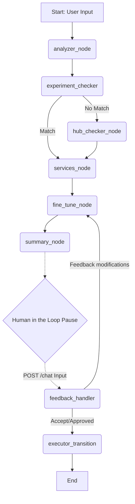

# Planner Agent (agent_v2) – Completed Walkthrough

I have successfully finished implementing the **Planner Agent** using **LangGraph** orchestrating the multi-stage logic and exposed via a **FastAPI** service inside the `agent_v2` directory.

## What Was Accomplished
* **Directory Structure Setup**: Established a clear and modular `agent_v2/app` folder structure.
* **Environment Configuration**: Configured `app/config.py` using `pydantic-settings` to securely resolve and read variables dynamically from the root `.env` directory.
* **LLM Abstraction**: Implemented `app/llm.py` which inspects `settings.LLM_PROVIDER` and conditionally resolves to an OpenAI (`ChatOpenAI`) or Groq (`ChatGroq`) implementation, ensuring robust fallback.
* **Tools Abstraction**: Set up `app/tools.py` containing tools customized with mock behaviors:
  - `check_existing_experiments` (returns empty to simulate no match).
  - `get_hub_faults` (mocked Chaos Hub records).
  - `list_kubernetes_deployments` (mocked to yield `chaos-backend`, `chaos-frontend`).
* **LangGraph Nodes Integration** (`app/nodes.py`):
    1. `analyzer_node`: Understands requirement goals from unstructured inputs.
    2. `experiment_checker_node`: Utilizes check tools.
    3. `hub_checker_node`: Looks up alternatives inside the hub.
    4. `services_node`: Identifies exact Kubernetes pods/deployments.
    5. `fine_tune_node`: Automatically generates optimal duration and variables.
    6. `summary_node`: Produces the plan and asks for validation.
    7. `feedback_handler_node`: Human in the loop step.
    8. `executor_transition_node`: Final transition confirming planner completion.
* **LangGraph Orchestration** (`app/graph.py`): Tied together nodes with exact state definitions (`app/state.py`) mapping logic pathways correctly and inserting an `interrupt_before` boundary exactly before feedback aggregation.
* **FastAPI Surface** (`app/main.py`): Exposes POST `/chat` and GET `/state/{thread_id}`, orchestrating LangGraph streams to accommodate paused Human-in-the-Loop workflows smoothly.

## Visualizing the Flow



## Running the Application Locally

To test this out, perform the following in your terminal:
```bash
cd agent_v2
python -m venv venv
venv\Scripts\activate
pip install -r requirements.txt
uvicorn app.main:app --reload
```

Then you can use `/docs` or send a POST request with:
```json
{
  "thread_id": "test-123",
  "message": "I want to test pod resource hogs"
}
```
You'll see the system traverse the nodes and return status `waiting_for_user`, along with the AI summarizing its fine-tuned execution plan.
